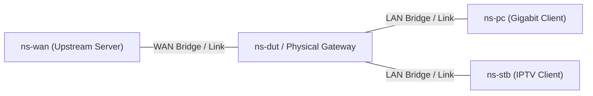

# Topology & Architecture - dhcplab

## Overview
This laboratory implements an evidence-based test bed supporting both Virtual Simulation and Physical Hardware topologies.

```mermaid
graph LR
    WAN["ns-wan (Upstream Server)"] ---|WAN Bridge / Link| DUT["ns-dut / Physical Gateway"]
    DUT ---|LAN Bridge / Link| PC["ns-pc (Gigabit Client)"]
    DUT ---|LAN Bridge / Link| STB["ns-stb (IPTV Client)"]
```
